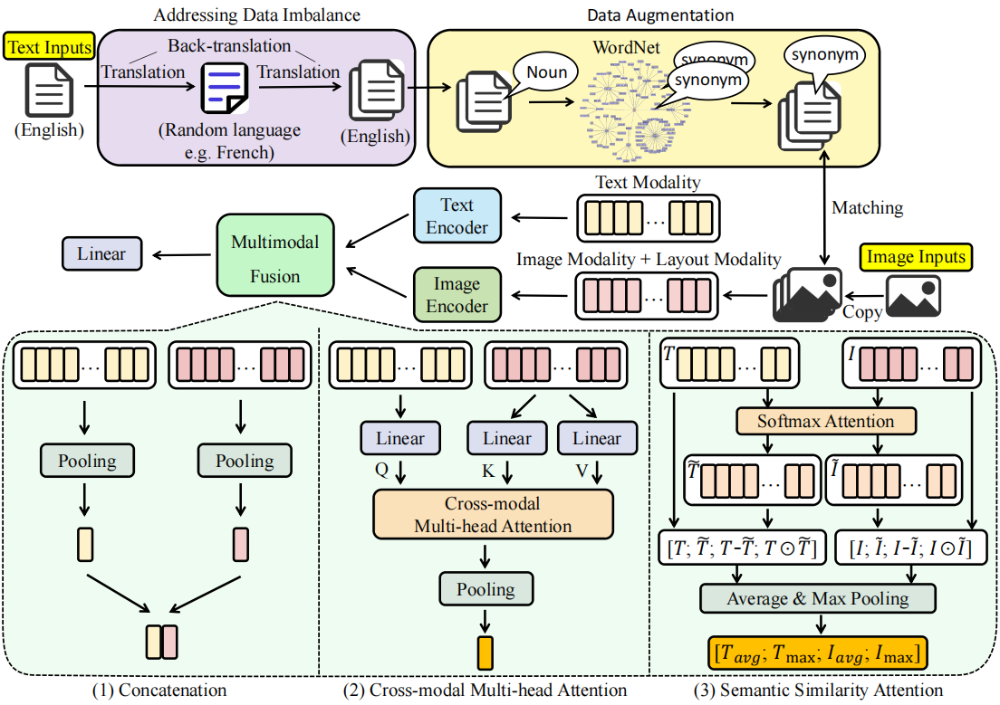

# TILFA: A Unified Framework for Text, Image, and Layout Fusion in Argument Mining

This repository is the official implementation of TILFA: A Unified Framework for Text, Image, and Layout Fusion in Argument Mining.

The paper is accepted to the workshop of EMNLP 2023.

## Abstract

A main goal of Argument Mining (AM) is to analyze an author's stance. 
Unlike previous AM datasets focusing only on text, 
the shared task at the 10th Workshop on Argument Mining 
introduces a [dataset](https://aclanthology.org/2022.argmining-1.1.pdf) including both text and images. 
Importantly, these images contain both visual elements 
and optical characters. Our new framework, **TILFA** 
(A Unified Framework for **T**ext, **I**mage, and **L**ayout **F**usion 
in **A**rgument Mining), is designed to handle this mixed data. It 
excels at not only understanding text but also detecting optical 
characters and recognizing layout details in images.
Our model significantly outperforms existing baselines, 
earning our team, KnowComp, the [**1st**](https://imagearg.github.io/) place in the leaderboard
of Argumentative Stance Classification subtask in this shared task.


## An Overview of Our Method

 

## Requirements

Python version is 3.7

requirements:
```
apex==0.9.10dev
boto3==1.28.10
botocore==1.31.10
datasets==2.3.2
detectron2==0.6+cu111
imbalanced_learn==0.10.1
imblearn==0.0
inflect==7.0.0
lxml==4.9.2
matplotlib==3.5.3
nltk==3.8.1
numpy==1.21.6
opencv_python==4.8.0.74
pandas==1.1.5
Pillow==9.5.0
Pillow==10.0.1
preprocessor==1.1.3
ptvsd==4.3.2
pytesseract==0.3.10
Requests==2.31.0
scikit_learn==1.0.2
spacy==2.2.1
stweet==2.1.1
tensorflow==2.14.0
textblob==0.17.1
timm==0.4.12
torch==1.10.0+cu111
torchvision==0.11.1+cu111
tqdm==4.65.0
transformers==4.12.5
tweet_preprocessor==0.6.0
websocket_client==1.6.3
```

You can install all requirements with the command
```
pip install -r requirements.txt
```

#Others

- code used to address data imbalance is in path ./data/TranslateDemo
- code used to do data augmentation is in path ./data/wordnet_augmentation
- training examples can be found in ./run.sh